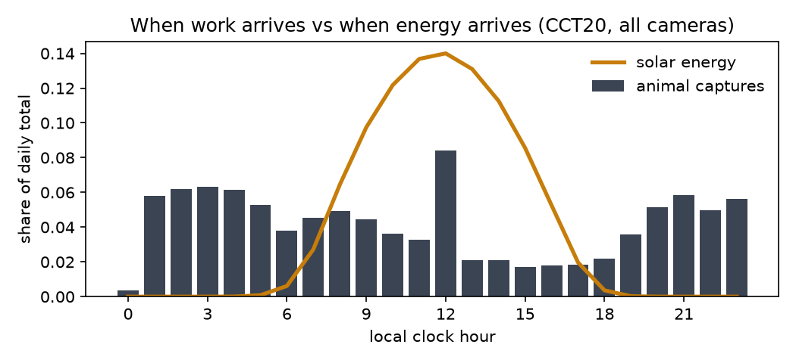
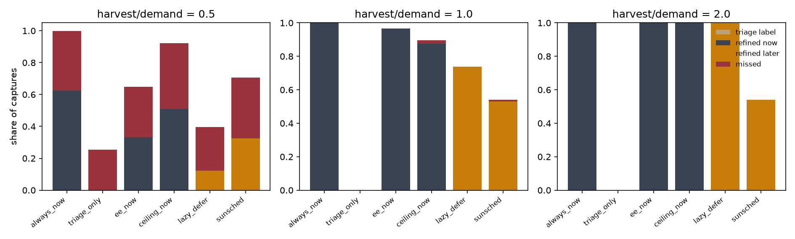
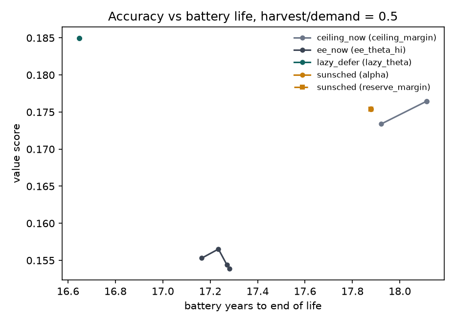
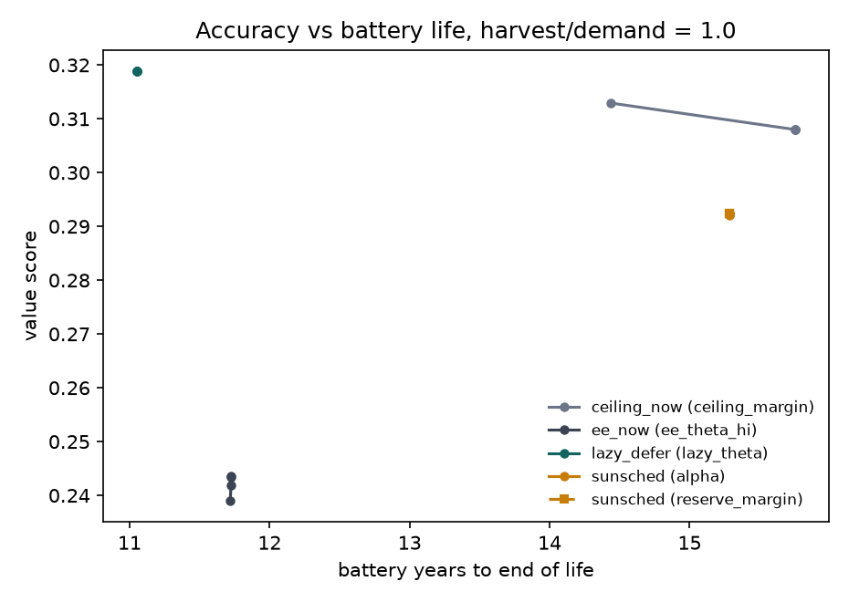
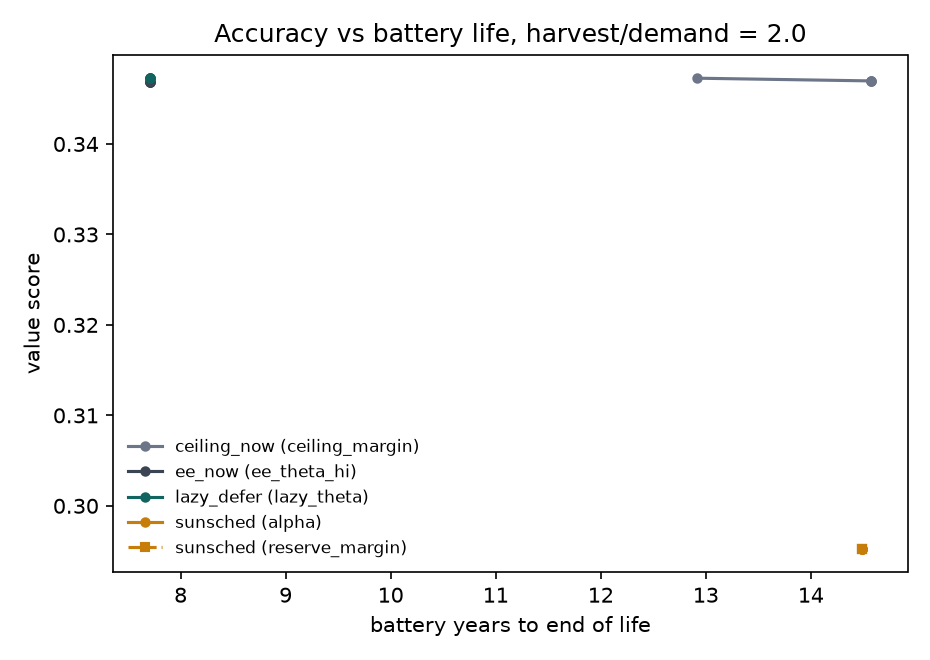
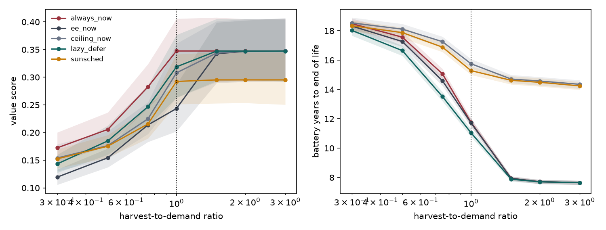

# SunSched results

Generated 2026-09-27 21:55. Irradiance source: **pvgis**. Preset: **full**. Site: cct_region. Weather years: [2011, 2012, 2013, 2014, 2015].

## 1. Why schedule in time

Across 53,850 animal captures from all 20 CCT20 cameras, **55.7%** arrive with the sun below the horizon, when harvest is zero. Only **17.9%** arrive with the sun above 40 degrees, which delivers **54.4%** of the energy. Hourly correlation between the two: -0.17.

Energy per action (J): `{'sleep_per_slot': 0.6, 'capture_day': 0.4, 'capture_night': 1.2, 'triage': 0.05102482944, 'store': 0.02, 'tier_b_wake': 12.0, 'refine_lite': 0.375572672, 'refine_full': 0.507017312}`

## 2. Classifier (frozen MobileNetV3-Large, trained exit heads)

Evaluated on the 9 held-out cameras (trans_test); temperatures fitted on trans_val.

| input height | exit | MMACs | accuracy | macro-F1 | animal-vs-empty | ECE before -> after |
|---|---|---|---|---|---|---|
| 160 | 0 | 51.2 | 0.225 | 0.163 | 0.838 | 0.145 -> 0.125 |
| 160 | 1 | 108.9 | 0.236 | 0.204 | 0.855 | 0.260 -> 0.014 |
| 160 | 2 | 153.8 | 0.209 | 0.211 | 0.879 | 0.199 -> 0.020 |
| 320 | 0 | 204.7 | 0.283 | 0.198 | 0.836 | 0.416 -> 0.021 |
| 320 | 1 | 434.1 | 0.242 | 0.201 | 0.857 | 0.276 -> 0.027 |
| 320 | 2 | 609.4 | 0.333 | 0.304 | 0.899 | 0.126 -> 0.125 |

## 3. Main comparison

Mean over held-out cameras x weather years, with 95% bootstrap CIs.

**Harvest-to-demand ratio 0.5**

| policy | value score | animal recall | missed | latency p95 (h) | battery years | time SoC>90% | wakes/day |
|---|---|---|---|---|---|---|---|
| always_now | 0.206 [0.176, 0.238] | 0.596 | 0.376 | 0.0 | 17.57 [17.18, 17.93] | 0.0% | 1.09 |
| sunsched_no_ceiling | 0.193 [0.171, 0.216] | 0.638 | 0.324 | 1.3 | 17.12 [16.77, 17.48] | 0.0% | 0.66 |
| lazy_defer | 0.185 [0.161, 0.212] | 0.661 | 0.273 | 48.0 | 16.65 [16.30, 16.98] | 0.0% | 0.14 |
| ceiling_now | 0.176 [0.154, 0.202] | 0.538 | 0.411 | 0.0 | 18.11 [17.73, 18.48] | 0.0% | 0.86 |
| sunsched_no_conformal | 0.175 [0.156, 0.196] | 0.585 | 0.382 | 1.1 | 17.88 [17.50, 18.24] | 0.0% | 0.63 |
| sunsched | 0.175 [0.156, 0.195] | 0.585 | 0.381 | 1.1 | 17.88 [17.51, 18.22] | 0.0% | 0.63 |
| triage_only | 0.168 [0.138, 0.201] | 0.675 | 0.255 | 0.0 | 16.35 [16.00, 16.71] | 0.0% | 0.00 |
| ee_now | 0.154 [0.138, 0.171] | 0.611 | 0.315 | 0.0 | 17.27 [16.92, 17.62] | 0.0% | 0.61 |
| sunsched_no_defer | 0.153 [0.134, 0.174] | 0.585 | 0.373 | 0.0 | 17.80 [17.43, 18.15] | 0.0% | 0.55 |
| sunsched_lite | 0.147 [0.121, 0.175] | 0.616 | 0.323 | 0.0 | 17.36 [17.02, 17.70] | 0.0% | 0.00 |

**Harvest-to-demand ratio 1.0**

| policy | value score | animal recall | missed | latency p95 (h) | battery years | time SoC>90% | wakes/day |
|---|---|---|---|---|---|---|---|
| always_now | 0.347 [0.294, 0.407] | 0.956 | 0.000 | 0.0 | 11.77 [11.49, 12.04] | 0.0% | 1.95 |
| lazy_defer | 0.319 [0.266, 0.378] | 0.940 | 0.000 | 43.9 | 11.05 [10.78, 11.31] | 0.0% | 0.89 |
| ceiling_now | 0.308 [0.262, 0.360] | 0.921 | 0.020 | 0.0 | 15.76 [15.44, 16.07] | 0.0% | 1.67 |
| sunsched_no_ceiling | 0.295 [0.251, 0.345] | 0.939 | 0.000 | 2.7 | 10.96 [10.68, 11.22] | 0.0% | 1.06 |
| sunsched | 0.292 [0.249, 0.342] | 0.930 | 0.010 | 4.3 | 15.29 [14.99, 15.57] | 0.0% | 1.10 |
| sunsched_no_conformal | 0.292 [0.249, 0.342] | 0.929 | 0.010 | 3.3 | 15.29 [15.00, 15.55] | 0.0% | 1.10 |
| sunsched_no_defer | 0.258 [0.220, 0.303] | 0.920 | 0.009 | 0.0 | 15.17 [14.87, 15.44] | 0.0% | 1.01 |
| ee_now | 0.243 [0.202, 0.289] | 0.910 | 0.000 | 0.0 | 11.73 [11.46, 11.99] | 0.0% | 1.86 |
| triage_only | 0.219 [0.180, 0.264] | 0.908 | 0.000 | 0.0 | 10.09 [9.75, 10.44] | 7.6% | 0.00 |
| sunsched_lite | 0.219 [0.177, 0.262] | 0.908 | 0.001 | 0.0 | 14.83 [14.54, 15.11] | 0.0% | 0.00 |

**Harvest-to-demand ratio 2.0**

| policy | value score | animal recall | missed | latency p95 (h) | battery years | time SoC>90% | wakes/day |
|---|---|---|---|---|---|---|---|
| always_now | 0.347 [0.293, 0.406] | 0.956 | 0.000 | 0.0 | 7.71 [7.56, 7.85] | 90.2% | 1.95 |
| lazy_defer | 0.347 [0.293, 0.406] | 0.956 | 0.000 | 10.7 | 7.70 [7.57, 7.84] | 91.0% | 1.19 |
| ceiling_now | 0.347 [0.292, 0.406] | 0.956 | 0.000 | 0.0 | 14.58 [14.29, 14.86] | 0.0% | 1.95 |
| ee_now | 0.347 [0.292, 0.405] | 0.956 | 0.000 | 0.0 | 7.71 [7.57, 7.85] | 90.2% | 1.95 |
| sunsched_no_ceiling | 0.295 [0.254, 0.345] | 0.939 | 0.000 | 2.8 | 7.70 [7.56, 7.85] | 91.0% | 1.09 |
| sunsched_no_conformal | 0.295 [0.254, 0.345] | 0.939 | 0.000 | 3.1 | 14.49 [14.21, 14.78] | 0.0% | 1.14 |
| sunsched | 0.295 [0.252, 0.345] | 0.939 | 0.000 | 3.1 | 14.49 [14.19, 14.77] | 0.0% | 1.14 |
| sunsched_no_defer | 0.261 [0.222, 0.309] | 0.929 | 0.000 | 0.0 | 14.46 [14.17, 14.74] | 0.0% | 1.04 |
| sunsched_lite | 0.219 [0.179, 0.263] | 0.908 | 0.000 | 0.0 | 14.30 [14.01, 14.58] | 0.0% | 0.00 |
| triage_only | 0.219 [0.179, 0.263] | 0.908 | 0.000 | 0.0 | 7.70 [7.56, 7.83] | 92.1% | 0.00 |

## 4. Kill test

**FAIL** against ee_now, ceiling_now, lazy_defer (margins: {'value_margin': 0.02, 'life_ratio': 1.15, 'value_tolerance': 0.01, 'life_tolerance': 0.05}). Per regime: {'0.5': False, '1.0': False, '2.0': False}.

| ratio | versus | value diff | p (Holm) | life ratio | p (Holm) | beats |
|---|---|---|---|---|---|---|
| 0.5 | ee_now | +0.021 | 0.000523 | x1.04 | 3.41e-13 | True |
| 0.5 | ceiling_now | -0.001 | 0.584 | x0.99 | 3.41e-13 | False |
| 0.5 | lazy_defer | -0.010 | 0.252 | x1.07 | 3.41e-13 | False |
| 1.0 | ee_now | +0.049 | 0.000163 | x1.31 | 3.41e-13 | True |
| 1.0 | ceiling_now | -0.016 | 0.258 | x0.97 | 3.41e-13 | False |
| 1.0 | lazy_defer | -0.026 | 0.258 | x1.39 | 3.41e-13 | False |
| 2.0 | ee_now | -0.052 | 0.00903 | x1.88 | 3.41e-13 | False |
| 2.0 | ceiling_now | -0.052 | 0.00903 | x0.99 | 3.41e-13 | False |
| 2.0 | lazy_defer | -0.052 | 0.00903 | x1.88 | 3.41e-13 | False |

## 5. Accuracy vs battery-life frontiers

## 6. Regime: where scheduling matters

## 7. Sensitivity to assumed constants

SunSched minus the best of the strong baselines at each setting (value score; battery-life ratio).

| assumption | setting | value diff | life ratio |
|---|---|---|---|
| aging.k_T | high | -0.010 | x1.08 |
| aging.k_T | low | -0.010 | x1.07 |
| aging.k_sigma | high | -0.010 | x1.11 |
| aging.k_sigma | low | -0.010 | x1.04 |
| aging.k_t | high | -0.010 | x1.07 |
| aging.k_t | low | -0.010 | x1.07 |
| battery.capacity_wh | high | -0.039 | x0.99 |
| battery.capacity_wh | low | -0.012 | x1.03 |
| control.deadline_h | high | -0.009 | x1.07 |
| control.deadline_h | low | -0.010 | x1.08 |
| control.min_ceiling | high | -0.000 | x1.06 |
| control.min_ceiling | low | -0.017 | x1.08 |
| node.e_capture_night_j | high | -0.008 | x1.07 |
| node.e_capture_night_j | low | -0.009 | x1.08 |
| node.p_sleep_w | high | -0.002 | x1.00 |
| node.p_sleep_w | low | -0.011 | x0.95 |
| node.tier_a_pj_per_mac | high | -0.010 | x1.07 |
| node.tier_a_pj_per_mac | low | -0.010 | x1.07 |
| node.tier_b_active_w | high | -0.011 | x1.08 |
| node.tier_b_active_w | low | -0.009 | x1.07 |
| node.tier_b_wake_j | high | -0.043 | x1.13 |
| node.tier_b_wake_j | low | -0.013 | x1.00 |
| site | bergen | +0.004 | x1.10 |
| site | dhaka | -0.009 | x1.10 |
| site | munich | -0.015 | x1.10 |
| site | nairobi | -0.010 | x1.08 |
| site | phoenix | -0.007 | x1.09 |
| solar.enclosure_gain_c | high | -0.010 | x1.07 |
| solar.enclosure_gain_c | low | -0.010 | x1.07 |

## 7b. Battery autonomy: can scheduling matter at all?

Days of load the battery holds, swept as a first-class axis rather than fixed. `ceil@floor` is the fraction of slots where the conformal ceiling was clipped to `control.min_ceiling`: near 1, the risk-controlled reserve cannot steer the battery whatever its coverage, the cell ages by calendar, and the comparison measures that floor rather than the schedule.

This sweep is **exploratory, not pre-registered**. The kill test in section 4 stands as the pre-registered result at the default sizing. Every level is reported here precisely so that no single one is selected after the fact.

| days | ratio | sunsched value | vs ee_now | vs ceiling_now | vs lazy_defer | life x best | ceil@floor |
|---|---|---|---|---|---|---|---|
| 0.5 | 0.5 | 0.063 | +0.000 | +0.000 | +0.000 | x1.00 | 0.00 |
| 0.5 | 1 | 0.167 | -0.001 | -0.001 | -0.075 | x1.08 | 0.00 |
| 0.5 | 2 | 0.189 | -0.014 | -0.013 | -0.099 | x1.09 | 0.00 |
| 1 | 0.5 | 0.051 | -0.000 | -0.000 | -0.000 | x1.00 | 0.00 |
| 1 | 1 | 0.193 | -0.002 | +0.006 | -0.078 | x1.08 | 0.00 |
| 1 | 2 | 0.217 | -0.047 | -0.026 | -0.118 | x1.20 | 0.00 |
| 2 | 0.5 | 0.032 | -0.000 | -0.000 | -0.000 | x1.00 | 0.00 |
| 2 | 1 | 0.213 | +0.008 | +0.027 | -0.046 | x1.32 | 0.01 |
| 2 | 2 | 0.278 | -0.019 | +0.023 | -0.066 | x1.58 | 0.03 |
| 3 | 0.5 | 0.017 | -0.001 | -0.001 | -0.000 | x1.00 | 0.00 |
| 3 | 1 | 0.213 | +0.002 | +0.030 | -0.041 | x1.47 | 0.15 |
| 3 | 2 | 0.281 | -0.037 | +0.019 | -0.064 | x1.85 | 0.38 |
| 5 | 0.5 | 0.008 | +0.000 | +0.000 | -0.000 | x1.00 | 0.23 |
| 5 | 1 | 0.215 | -0.003 | +0.029 | -0.036 | x1.57 | 0.53 |
| 5 | 2 | 0.286 | -0.047 | +0.008 | -0.060 | x2.00 | 0.80 |
| 10 | 0.5 | 0.013 | +0.002 | +0.001 | -0.001 | x1.00 | 0.97 |
| 10 | 1 | 0.215 | -0.005 | +0.019 | -0.036 | x1.52 | 0.97 |
| 10 | 2 | 0.293 | -0.049 | -0.026 | -0.054 | x2.03 | 0.97 |
| 30 | 0.5 | 0.030 | +0.001 | -0.002 | +0.003 | x1.00 | 0.98 |
| 30 | 1 | 0.218 | -0.014 | +0.011 | -0.066 | x1.52 | 0.98 |
| 30 | 2 | 0.295 | -0.051 | -0.047 | -0.053 | x2.00 | 0.98 |
| 100 | 0.5 | 0.102 | +0.011 | +0.007 | -0.017 | x1.04 | 0.98 |
| 100 | 1 | 0.274 | +0.038 | -0.001 | -0.035 | x1.45 | 0.98 |
| 100 | 2 | 0.295 | -0.052 | -0.051 | -0.052 | x1.94 | 0.98 |
| 175 | 0.5 | 0.180 | +0.022 | +0.005 | -0.006 | x1.08 | 0.98 |
| 175 | 1 | 0.290 | +0.047 | -0.015 | -0.027 | x1.38 | 0.98 |
| 175 | 2 | 0.295 | -0.051 | -0.052 | -0.052 | x1.88 | 0.98 |

## 8. What is assumed, not measured

- No hardware: node power figures are datasheet-typical assumptions (`NodeCfg`), swept in section 7.
- Battery ageing uses the Xu et al. (IEEE Trans. Smart Grid 2018) semi-empirical model; constants must be checked against the paper and are swept +/-50%.
- Enclosure heating (battery temperature above air temperature) is an assumption, swept 0-30 C.
- Camera coordinates are region-level (CCT does not publish them); capture clock times may include daylight saving time.
- Captures from several calendar years at one camera are laid onto one simulated year.
- MAC counts are measured from the real network; energy per MAC is assumed.
- `sunsched` and `sunsched_no_conformal` differ only in the reserve forecaster, so compare them on `reserve_coverage` in `tables/runs.csv`: the conformal bound should sit near 1 - alpha and the point forecast well below it. Meeting that target is not the same as steering the battery. If `ceiling_at_floor_frac` is near 1, the bound was clipped to `control.min_ceiling` before it reached the cell, and no lifetime difference may be credited to the reserve however good its coverage looks. That is what happens when the battery holds many days of load: see `days_of_autonomy` in `environment_summary.json`, and the `control.min_ceiling` and `battery.capacity_wh` rows of section 7.
